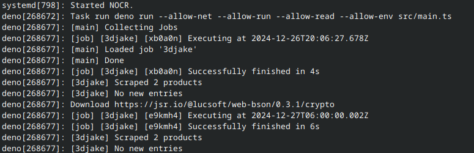

# NOCR

NOCR (No Cron) is a task scheduler that can execute scripts and programs using simple JSON configuration files written in Typescript for the Deno runtime. It uses cron-style scheduling and supports environment variables.

Current scripts:

- [3DJake](jobs/3djake): Monitor 3D Jake's (a German online shop for 3D Printers) outlet page and send push notifications if new deals get added

## Adding scripts / programs

Note: For Deno programs: Use `jobs/utils` to send push notifications and connect to a MongoDB database

1. Place your script / program in a new folder under `jobs/`
2. Create a `job.json` configuration file in the same folder:

```json
{
    "$schema": "../utils/job.schema.json", 
    "schedules": [
        "0 6 * * *", // List of cron schedule expressions (see https://crontab.guru/) 
    ],
    "executable": "~/.deno/bin/deno", // Absolute path (~ also allowed) to executable / Relative path to script
    "args": [ 
        "run",
        "--allow-all",
        "main.ts"
    ],
    "requires": [ 
        "mongo",
        "ntfy" // Program requirements, currently only mongo and ntfy available
    ],
    "env": [
        "GROQ_API_KEY" // Additional environment variables that get passed down
    ]
}
```

## Installing

1. Install Deno: [https://deno.com/](https://deno.com/)
2. Clone the repo: `git clone https://github.com/playlogo/NOCR.git`
3. Create a `.env` file, checkout the documentation of the jobs for required env variables
4. Get the path of the deno executable: `which deno`
5. Setup a systemd service:
    - Create systemd user service: `nano ~/.config/systemd/user/nocr.service`
    - Reload systemd config: `systemctl --user daemon-reload`
    - Enable & Start service: `systemctl --user enable nocr --now`
    - View logs: `journalctl --user -u nocr -e -f`

```shell
# ~/.config/systemd/user/nocr.service
[Unit]
Description=NOCR
After=network.target
StartLimitIntervalSec=0

[Service]
Type=simple
Restart=always
RestartSec=3
WorkingDirectory=/home/${your username}/NOCR
ExecStart=${deno path} task run

[Install]
WantedBy=default.target
```

## Screenshot


